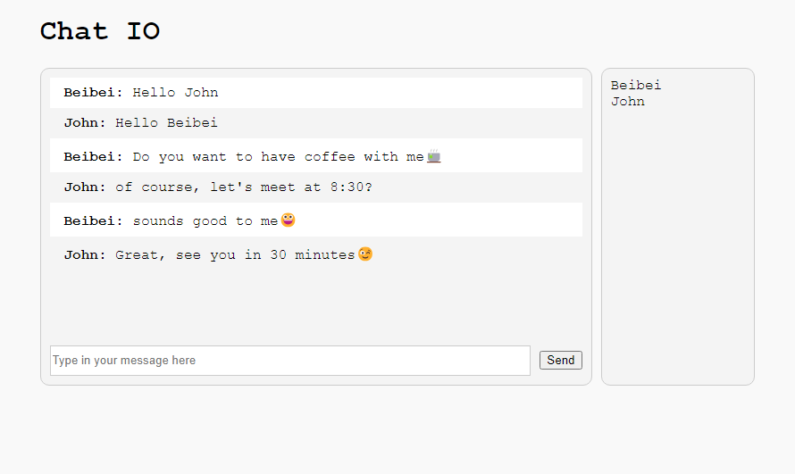

# Chat IO

## Overview
This is a simple chat application built with NodeJS and Socket.IO that allow multiple users to chat in real-time.

## Built With
- NodeJS
- Express
- Socket.IO

## Live Demo

Check out the live Demo [Chat IO](https://chatio.beibeiyang.dev/).

## Features

## License
The code is licensed under [Apache 2.0](https://www.apache.org/licenses/LICENSE-2.0.txt).

## Contact
- Beibei Yang [beibeiyang88@hotmail.com](mailto:beibeiyang88@hotmail.com)
